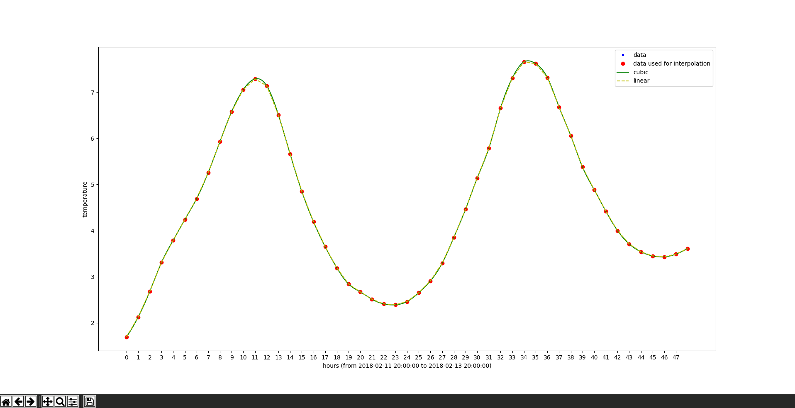
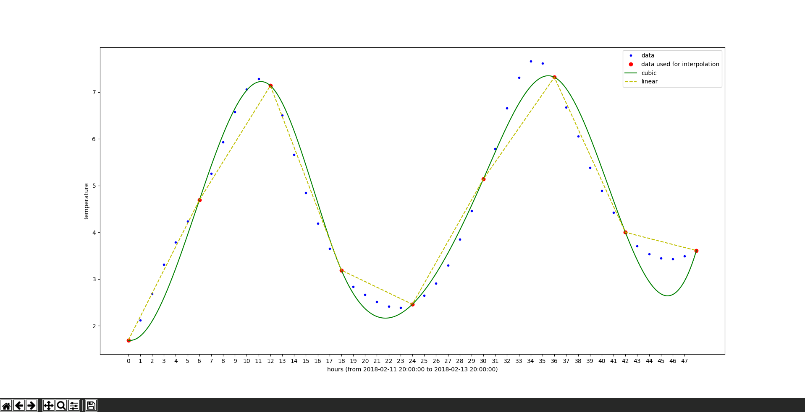

# weather-data-interp
Interpolate hourly weather data from [Darksky](https://darksky.net) API using linear and cubic spline interpolation.

1. Get weather data (replace **b1946ac92492d2347c6235b4d2611184** with your api key from [Darksky](https://darksky.net/dev)):
    ```
    $ python get_data.py b1946ac92492d2347c6235b4d2611184 34.716851 137.854584 temperature
    querying https://api.darksky.net/forecast/b1946ac92492d2347c6235b4d2611184/34.716851,137.854584?units=si&exclude=flags,daily
    saving temperature data to csv
    ```
2. Use downloaded data for interpolation
    ```
    $ python plot_data.py data/1518372294_temperature.csv 1
    ```
    
3. Use less data points for interpolation
    ```
    $ python plot_data.py data/1518372294_temperature.csv 6
    ```
    


## setup
1. install python gui package (https://wiki.python.org/moin/TkInter)
    * ubuntu - `apt install python-tk`
    * arch - `pacman -S tk`
2. install required python packages
    * `pip install -r requirements.txt`

## usage
1. get data using `get_data.py` (only supports hourly data, see https://darksky.net/dev/docs#data-point)
    * `python get_data.py <darksky api key> <latitude> <longitude> <data you're interested in>`
    * data is saved in the current directory under `data/` in `.csv` format
2. plot data using `plot_data.py`
    * `python plot_data.py <path to csv file> <every n hours to take for interpolation>`
